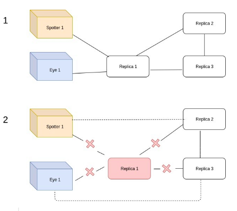

# Relatório do projeto Sauron

[Sistemas Distribuídos](https://fenix.tecnico.ulisboa.pt/disciplinas/SDis126451113264/2019-2020/2-semestre/pagina-inicial) 2019-2020, segundo semestre

## Autores

**Grupo A21**

| Número | Nome                  | Utilizador                          | Correio eletrónico                     |
| -------|-----------------------|-------------------------------------| ---------------------------------------|
| 97023  | Lourenço Duarte       | <https://github.com/LourencoPonces> | <lourenco.duarte@tecnico.ulisboa.pt>   |
| 89498  | Maria Beatriz Martins | <https://github.com/apollee>        | <maria.d.martins@tecnico.ulisboa.pt>   |
| 89526  | Pedro Lamego          | <https://github.com/pedro-lamego>   | <pedrownlamego@tecnico.ulisboa.pt>     |

  

## Melhorias da primeira parte

### Testes 
- [Mudança dos nomes dos testes para o nome das operações correspondentes](https://github.com/tecnico-distsys/A21-Sauron/commit/fda4153346d0201c5d60fba269ff8b064bd5e419) [AND](https://github.com/tecnico-distsys/A21-Sauron/commit/eb6d2a034d0fb05e25c93757b14fd767d1801a4e)
- [Adição de testes para testar coordenadas inválidas na operação camJoin](https://github.com/tecnico-distsys/A21-Sauron/commit/56847d55775f5095154ab5e913f395c9ee6aad27) [AND](https://github.com/tecnico-distsys/A21-Sauron/commit/88461de9c58cc500d952abc8a1465491a32b0e40)
- [Adição de testes ao Track, TrackMatch e Trace de forma a testar com pessoas, carros e com ids (utilizando o * em diversos locais p.ex 2*, 12*34, 1*)](https://github.com/tecnico-distsys/A21-Sauron/commit/5886da83d06d62223e81935706ae6b74f9e63f91)

### Ordenações
- [Adição da ordenação por id ao fazer spot](https://github.com/tecnico-distsys/A21-Sauron/commit/8f6b11e17ee6e890d4788239a12ecfa2178122e2)
- [Adição da ordenação da observação mais recente para a mais antiga ao fazer trail](https://github.com/tecnico-distsys/A21-Sauron/commit/a94093a7d57a679147e85d79c5c1622ab29ea0a3)

### Domínio 
- [Criação de uma classe para o domínio e separação de apresentação-domínio](https://github.com/tecnico-distsys/A21-Sauron/commit/f299acfcbf0a151c02eac33c48302d873ff75c70)
- [Tratamento de erros: Utilização de erros correspondentes ao que aconteceu para além de invalid arguments](https://github.com/tecnico-distsys/A21-Sauron/commit/f299acfcbf0a151c02eac33c48302d873ff75c70)
- [No proto: Criação de um nested type para as coordenadas e mudança de nome Result para Observation](https://github.com/tecnico-distsys/A21-Sauron/commit/fb46dae7ce085ccd530bf69aaa1218c20fbfd7a7)

### Guião
- [Guião completo de acordo com as sugestões feitas pelo professor](https://github.com/tecnico-distsys/A21-Sauron/commit/53a30837d90044827339cf82c95f80f2078dc02d)

### Código
- [Código mais legível com comentários javadoc](https://github.com/tecnico-distsys/A21-Sauron/commit/a228d0b18f79eb7c12776abb9088143a054f4159)
- [Tratamento de exceções alterado](https://github.com/tecnico-distsys/A21-Sauron/commit/c4f8249d54914a8c01495561f7e90bb3b848df9a)

## Modelo de faltas
É necessário assumir todos pressupostos referidos pelo enunciado(2.1) para o modelo de interação e faltas, no entanto para além disso a nossa implementação permite o seguinte:
- Quando se desconecta um servidor ou quando não se obteve uma resposta em x tempo ele garante a troca para outro e a execução do pedido na mesma
- Quando um servidor se reconecta à rede de servidores ou se liga pela primeira vez consegue adquirir toda a informação previamente guardada
- Leitura coerente como descrito pelo enunciado(2.3)
- Se o servidor estiver ativo na rede mesmo que ocorram perdas nos pacotes(ligações UDP) eventualmente ocorreram atualizações que salvaguardam estas situações

Contudo, não tem capacidade para lidar com a seguintes situações devido a não ter coerência forte:
- Se um servidor morrer sem transmitir a informação local não se consegue voltar a reaver essa informação
- Falha de todas as réplicas em simultâneo

## Solução

Uma réplica é inicializada no momento em que se liga um silo-server. São passados como argumentos o número da réplica atual e o número total de réplicas. É também definido o tempo que deve ocorrer entre mensagens gossip. Após isto, é inicializada uma thread.

Vamos utilizar os dois casos apresentados na imagem para descrever a solução do Gossip.
Vamos começar na parte 1 da imagem em que a ideia é o eye1 fazer uma observação que é recebida pela réplica 1. A réplica 1 em seguida faz um gossip para a réplica 2 e 3 e o spotter 1 faz um spot da observação anterior e obterá uma resposta a partir da réplica 1.

Neste caso o gossip acontece da seguinte forma: a réplica 1 verifica que réplicas existem para além de si, sendo estas a réplica 2 e a réplica 3. Depois, conecta-se a uma das réplicas (conectando-se a todas eventualmente). 

Este processo envolve a troca de mensagem de acordo com o protocolo de replicação e a efetuação de comparações de forma a obter uma lista de observações que deve ser enviada na resposta. Esta lista de observações será depois guardada pela réplica 1. O processo é repetido para a outra réplica em falta, que será ou a réplica 2 ou a 3.

Na parte 2 da imagem é exemplificada uma falha na réplica 1. Sendo assim torna-se impossível para os clientes(eye e spotter) realizarem operações com a réplica 1. O que acontece então é que o eye é reconectado automaticamente a uma das réplicas funcionais(na imagem optámos pela réplica 3) que contêm a informação que estava na réplica 1 e de forma semelhante o spotter vai conectar-se à réplica 2. Devido ao processo de gossip ter sido efetuado, o spotter vai conseguir aceder a toda a informação necessária quando pretender efetuar a operação spot.

## Protocolo de replicação

O protocolo que estamos a utilizar é uma variante do protocolo gossip architecture com coerência fraca. É point to point, no sentido em que ocorre uma conexão direta entre réplicas e utiliza um timestamp vetorial e um número de sequência.

A troca de mensagens no protocolo ocorre da seguinte forma: a réplica(1) envia um timestamp vetorial e a réplica(2) recebe esse mesmo timestamp vetorial compara-o com o seu e devolve as observações que tem que a réplica 1 não tem. 

## Opções de implementação

- **Cache** - Foi implementada uma cache do lado do cliente (spotter) de forma a garantir alguma coerência. Assim, quando um cliente faz um pedido este fica guardado na cache e caso o cliente se reconecte a outra réplica e seja feito o mesmo pedido, mesmo que esta não tenha essas observações, as mesmas vão ser apresentadas ao utilizador. Esta cache consegue guardar até 100 pedidos(número pode ser alterado no construtor) diferentes com a sua respectiva resposta,  timestamp vetorial e número de sequência. Guardamos o timestamp vetorial, pois é com este que verificamos se atualizamos os valores na cache ou não. Caso sejam iguais ou concorrentes, ou seja, um tem certas entradas maiores que o outro e vice versa, e.g. [1,2,3] [3,2,1] não se faz nada. No entanto, se o timestamp recebido for maior ou igual em todas as suas entradas, então troca-se e atualiza se o número de sequência. O número de sequência serve para saber qual é o pedido mais antigo e assim saber qual a posição da cache que queremos substituir(apenas se a cache estiver cheia e o spotter fizer um novo pedido).

- **Argumento do número de réplicas** - de forma a passar o número de réplicas que vão existir optámos por existir mais um argumento(o último) a ser passado ao servidor que representa este valor. O valor não pode exceder 9.
- **Ordem Gossip** - na escolha das réplicas optámos por fazer pedidos a todas as réplicas disponíveis, tendo em conta que o número de réplicas é bastante reduzido, como já referido anteriormente. Esta seleção é feita de forma aleatória para diminuir os acessos múltiplos ordenados, ou seja, as réplicas conectarem-se todas pela mesma ordem podendo haver vários pedidos para a mesma réplica em instantes próximos. 
Poderíamos ter optado por contactar uma vizinhança, porém tendo em conta a dimensão do problema decidimos que era mais importante aumentar a coerência entre as réplicas do que melhorar o desempenho e diminuir a concorrência destes pedidos.
- **Eye a reconectar-se com outra réplica** - optámos por efectuar um cam join sempre que isto acontece e esta reconexão é aleatória. 
- **Periodicidade** - optámos por ter uma variável no ficheiro SiloServerApp chamada time em que pode ser alterada a periodicidade com que o gossip é efetuado. O tipo está em segundos, portanto time = 60 corresponderia a um minuto.
- **Estruturas de dados** - de forma a representar os dados utilizámos duas estruturas a  _listObservations e _listReplicObservations que guardam as observações e ponteiros para essas, respectivamente. Porém, a primeira está organizada por id da observação para facilitar a procura e a segunda está organizada por réplica que a inseriu facilitando assim o envio de informação a outras réplicas. Esta solução melhora o desempenho das duas operações apesar de aumentar a redundância pois, para além de ter que guardar os objectos em memória haverá também os ponteiros para esses. 
Para além de guardarmos estas duas estruturas temos ainda a estrutura _hashCameras que permite facilitar a procura nas validações da câmera e ao efetuar o comando camInfo.
- **Número de sequência** - de forma a saber que observações devem ser enviadas no gossip estamos a utilizar este número, que serve para saber exatamente quais observações queremos enviar, de forma a evitar que por concorrência se estivesse a enviar outras observações não necessárias.

